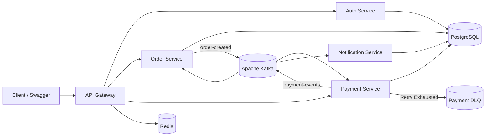

# Event-Driven Payment System

A production-style event-driven payment processing system built using Spring Boot, Apache Kafka, PostgreSQL, Redis, JWT authentication, and Spring Cloud Gateway.

## Architecture

The system consists of the following microservices:

- API Gateway
- Auth Service
- Order Service
- Payment Service
- Notification Service

## Tech Stack

- Java 21
- Spring Boot
- Spring Cloud Gateway
- Spring Security
- JWT Authentication
- Apache Kafka
- PostgreSQL
- Redis
- Docker
- Maven
- Swagger / OpenAPI

## System Flow

Client
→ API Gateway
→ JWT Authentication
→ Order Service
→ Kafka `order-created`
→ Payment Service
→ Kafka `payment-events`
→ Order Service
→ Notification Service

## Saga Flow

### Payment Success

Order CREATED
→ Payment SUCCESS
→ Order CONFIRMED
→ Notification processed

### Payment Failure

Order CREATED
→ Payment FAILED
→ Order CANCELLED
→ Notification processed

### Technical Failure

Order CREATED
→ Payment processing exception
→ Kafka retry
→ Retry exhausted
→ Dead Letter Queue (`payment-dlq`)

## Idempotency

Payment APIs support idempotency using the `Idempotency-Key` header.

Repeated requests with the same idempotency key return the original payment response and prevent duplicate payment creation.

## API Gateway

The API Gateway provides:

- Centralized routing
- JWT validation
- Rate limiting
- Redis-backed rate limiting
- Request logging

## Authentication

The Auth Service provides:

- User registration
- User login
- BCrypt password encryption
- JWT token generation
- JWT validation

## Notification Service

The Notification Service asynchronously consumes payment events and stores notification records.

The architecture can be extended to support:

- Email notifications
- SMS notifications
- Push notifications

## Tested Scenarios

| Amount | Payment Result | Order Result |
|---|---|---|
| 900 | SUCCESS | CONFIRMED |
| 1500 | FAILED | CANCELLED |
| 9999 | Technical Failure | Retry → DLQ |

## Infrastructure

Docker Compose is used to run:

- PostgreSQL
- Apache Kafka
- Zookeeper
- Redis

## Author

Satya Dangeti