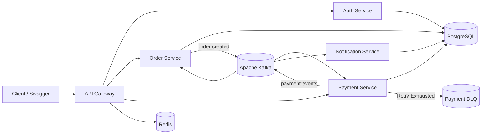

# Event-Driven Payment System

A production-style event-driven payment processing system built using Spring Boot, Apache Kafka, PostgreSQL, Redis, JWT authentication, and Spring Cloud Gateway.

## Architecture

The system consists of the following microservices:

- API Gateway
- Auth Service
- Order Service
- Payment Service
- Notification Service



## Tech Stack

- Java 21
- Spring Boot
- Spring Cloud Gateway
- Spring Security
- JWT Authentication
- Apache Kafka
- PostgreSQL
- Redis
- Docker
- Maven
- Swagger / OpenAPI

## System Flow

Client
→ API Gateway
→ JWT Authentication
→ Order Service
→ Kafka `order-created`
→ Payment Service
→ Kafka `payment-events`
→ Order Service
→ Notification Service

## Saga Flow

### Payment Success

Order CREATED
→ Payment SUCCESS
→ Order CONFIRMED
→ Notification processed

### Payment Failure

Order CREATED
→ Payment FAILED
→ Order CANCELLED
→ Notification processed

### Technical Failure

Order CREATED
→ Payment processing exception
→ Kafka retry
→ Retry exhausted
→ Dead Letter Queue (`payment-dlq`)

## Idempotency

Payment APIs support idempotency using the `Idempotency-Key` header.

Repeated requests with the same idempotency key return the original payment response and prevent duplicate payment creation.

## API Gateway

The API Gateway provides:

- Centralized routing
- JWT validation
- Rate limiting
- Redis-backed rate limiting
- Request logging

## Authentication

The Auth Service provides:

- User registration
- User login
- BCrypt password encryption
- JWT token generation
- JWT validation

## Notification Service

The Notification Service asynchronously consumes payment events and stores notification records.

The architecture can be extended to support:

- Email notifications
- SMS notifications
- Push notifications

## Tested Scenarios

| Amount | Payment Result | Order Result |
|---|---|---|
| 900 | SUCCESS | CONFIRMED |
| 1500 | FAILED | CANCELLED |
| 9999 | Technical Failure | Retry → DLQ |

## Infrastructure

Docker Compose is used to run:

- PostgreSQL
- Apache Kafka
- Zookeeper
- Redis

## Running the Project

### Prerequisites

Ensure the following are installed:

- Java 21
- Maven
- Docker
- Docker Compose
- PostgreSQL client (optional)
- Git

### 1. Clone the Repository

```bash
git clone https://github.com/SatyaDangeti/payment-system.git
cd payment-system
git checkout saga-implementation
```

### 2. Configure JWT Secret

The Auth Service and API Gateway must use the same JWT secret.

#### Windows PowerShell

```powershell
$bytes = New-Object byte[] 64
[System.Security.Cryptography.RandomNumberGenerator]::Create().GetBytes($bytes)
$env:JWT_SECRET = ([System.BitConverter]::ToString($bytes)).Replace("-", "")
```

### 3. Start Infrastructure

```bash
docker-compose up -d
```

This starts:

- PostgreSQL
- Apache Kafka
- Zookeeper
- Redis

### 4. Start the Microservices

Run each service in a separate terminal.

```bash
cd auth-service
mvn spring-boot:run
```

```bash
cd api_gateway
mvn spring-boot:run
```

```bash
cd order_service
mvn spring-boot:run
```

```bash
cd payment_service
mvn spring-boot:run
```

```bash
cd notification_service
mvn spring-boot:run
```

## Service Ports

| Service | Port |
|---|---|
| API Gateway | 8080 |
| Payment Service | 8081 |
| Order Service | 8082 |
| Notification Service | 8083 |
| Auth Service | 8084 |

## Swagger Documentation

| Service | Swagger URL |
|---|---|
| Auth Service | `http://localhost:8084/swagger-ui/index.html` |
| Payment Service | `http://localhost:8081/swagger-ui/index.html` |
| Order Service | `http://localhost:8082/swagger-ui/index.html` |
| Notification Service | `http://localhost:8083/swagger-ui/index.html` |

## Testing the Saga Flow

### Success Scenario

Create an order with amount `900`.

Expected flow:

```text
Order CREATED
→ Payment SUCCESS
→ Payment event published
→ Order CONFIRMED
→ Notification stored
```

### Business Failure Scenario

Create an order with amount `1500`.

Expected flow:

```text
Order CREATED
→ Payment FAILED
→ Payment event published
→ Order CANCELLED
→ Notification stored
```

### Technical Failure Scenario

Create an order with amount `9999`.

Expected flow:

```text
Payment processing exception
→ Retry mechanism triggered
→ Retries exhausted
→ Message sent to payment-dlq
```

## Future Improvements

- Email and SMS notifications
- Distributed tracing dashboard
- Kubernetes deployment
- CI/CD pipeline
- Testcontainers integration tests
- Outbox Pattern for reliable event publishing

## Author

Satya Dangeti